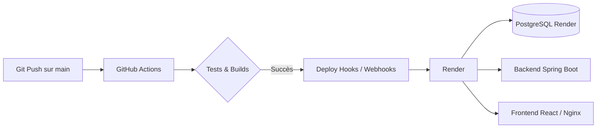

# Plan de Déploiement CI/CD (GitHub Actions & Render)

Ce document retrace le plan pas-à-pas pour automatiser les tests et le déploiement de l'application Task Manager (React + Spring Boot + PostgreSQL).

---

## Architecture cible du pipeline

---

## Les Étapes du Projet

###  Étape 1 : Création et configuration des services sur Render
- [x] Créer la base de données PostgreSQL managée sur Render.
- [x] Créer le Web Service Docker pour le Backend Spring Boot.
- [x] Créer le Web Service Docker pour le Frontend React.
- [x] Récupérer les URLs et les Deploy Hooks fournis par Render.

###  Étape 2 : Adaptation de la configuration Frontend (Nginx & URLs de Prod)
- [x] Comprendre comment Nginx redirige vers l'API du backend une fois déployé sur Render (gestion des URLs publiques vs locales).
- [x] Adapter les variables d'environnement si nécessaire sans casser l'environnement local.

###  Étape 3 : Création du workflow GitHub Actions (.github/workflows/ci-cd.yml)
- [x] Écrire le job d'Intégration Continue (CI) :
  - Compilation & vérification du backend Java avec Maven.
  - Compilation & vérification du frontend React avec Node.
- [x] Écrire le job de Déploiement Continu (CD) :
  - Déclenchement automatique des déploiements sur Render via les GitHub Secrets & Deploy Hooks.

###  Étape 4 : Test end-to-end et validation
- [x] Pousser une modification sur GitHub (`git push`).
- [x] Observer l'exécution du workflow GitHub Actions.
- [x] Vérifier que l'application est bien en ligne, fonctionnelle et connectée à la base de données sur Render.
